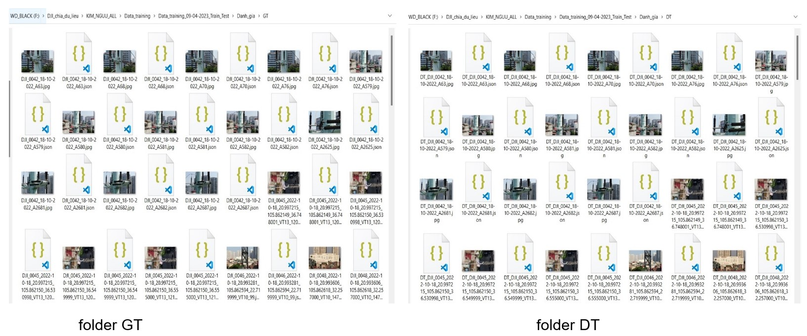
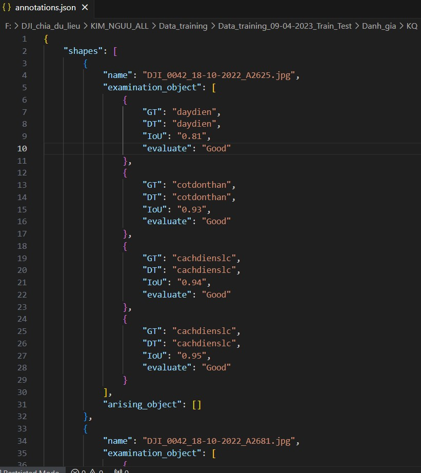
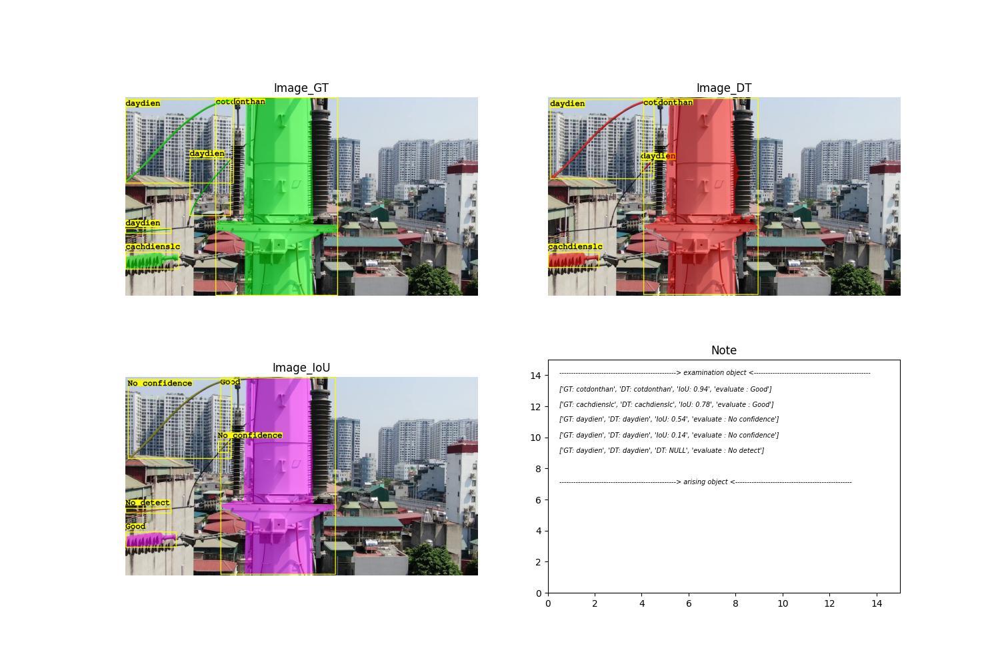
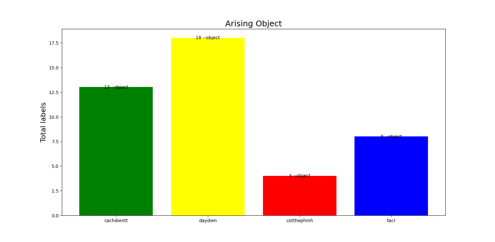
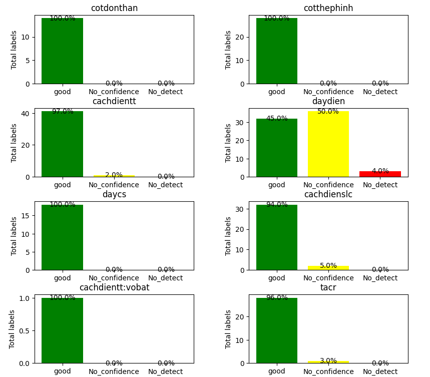

# Evaluate_Detectron2_Instance_Segmentation
###  Tool vote_detectron2 được viết ra nhằm mục đích đánh giá độ nhận diện chính xác của từng đối tượng sau khi ảnh được chạy với model detectron2 áp dụng trong bài toán instance segmentation đối tượng mình gán nhãn.

###  Ta có 2 folder chính là :  folder GT (Ground Truth)  chính là folder test chứa các ảnh test và file gán nhãn định dạng Json (gán bằng tool Labelme kiểu polygons) và folder DT (Detection) folder chứa file có thông tin nhận đạng đối tượng trong ảnh GT sau khi cho vào model detect được kết quả viết vào theo kiểu gán nhãn labelme , gán polygons, định dạng file Json.

###  Bộ tool sẽ đánh giá từng đối tượng thông qua chỉ IoU = Area of Overlap/ Area of Union, thay vì dùng box để tính bây giờ ta dùng polygon bo đối tượng để tính. Dựa vào giá trị IoU ta sẽ phân làm 3 khoảng là :

**Điều kiện để xếp vào từng trường hợp :**
* 1, detect Good : IoU > 60 , đối tượng trong DT dc đưa ra so IoU với đối tượng trong GT phải cùng tên

* 2, detect No confidence : IoU <= 60 , đối tượng trong DT dc đưa ra so IoU với đối tượng trong GT phải cùng tên

* 3, detect No detect : có 2 trường hợp tạo thành
    - 3.1 : chỉ số IoU Max == 0
    - 3.2 : chỉ số IoU Max > 0 , đối tượng trong DT dc đưa ra so IoU với đối tượng trong GT không cùng tên

Rồi ta xét từng khỏang của đối tượng có số lượng bao nhiêu
- Tập ảnh Test (GT) mình sử dụng gồm 76  ảnh, 8 lớp, ảnh được thu bằng UAV trên lưới điện 110Kv.

- class_name = | 'daydien', 'cachdienslc', 'cachdientt', 'cotthephinh', 'cotdonthan', 'tacr', 'daycs','cachdientt:vobat' |

**Tool vote_detectron2 sẽ gồm 3 bước :**

* B1 : Gán nhãn tự động tập ảnh test ghi vào folder DT

* B2 : xác định các đối tượng của ảnh là : good , no confidence hay no detect rồi ghi vào file tổng annotations.json và xuất ra ảnh đánh giá tổng quát về các đối tượng của từng ảnh.
-	File annotations

-	Đánh giá tổng quát trên từng ảnh

* B3 : Đọc file annotations.json vẽ biểu đồ trực quan hóa các giá trị good , no confidence, no detect của từng lớp trên tổng số ảnh đánh giá.
-	Biểu đồ đối tượng phát sinh ( đối tượng không có trong folder GT mà model phát hiện ra)

-	Biểu đồ thể hiện các giá good , no confidence, no detect của từng lớp

